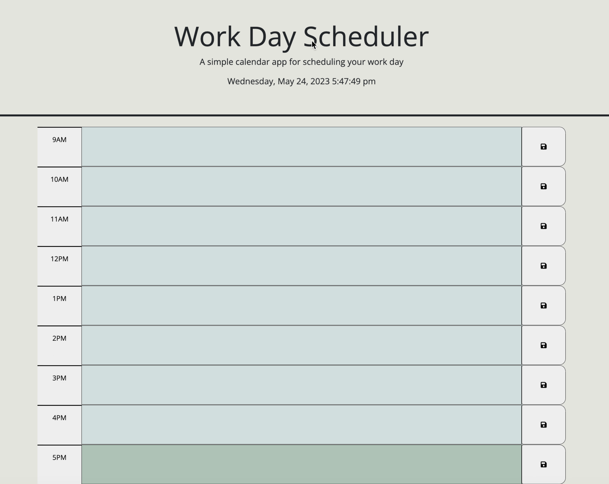

# Work Day Schedule
## Description
For this project, we implemented the API skills that we've been taught to create a daily schedule. My motivation for this project was to increase my Javascript skills and learning as I'm greatly struggling with it. While completing this assignment, I learned more about JavaScript and how incredible it is. 
## Installation 
N/A
## Deployed Site
https://lizcas01.github.io/work-day-scheduler/
## Usage

On the very top, you'll see the current day, hour, minutes, and seconds. On the left side, you'll see hours from 9-5. You can click on the middle boxes and type in anything that needs to be done during that certain time. When you want to save your changes, click on the right "save" button. To better help you, the middle boxes will change colors depending if the hour is currently in the past, present, or future. 
## Credits
N/A
## License
Please refer to the LICENSE in the repo. 
